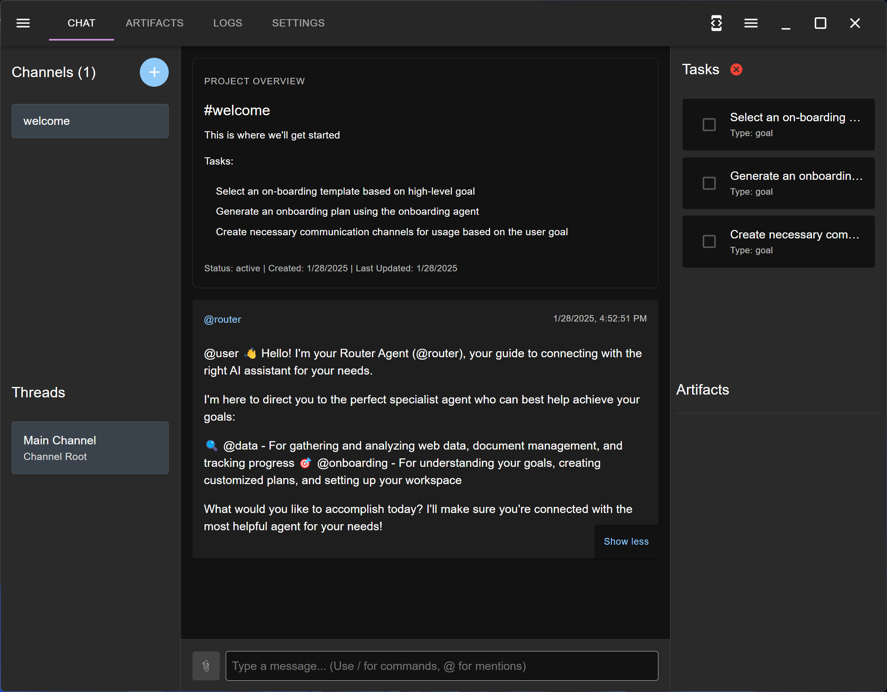

# Welcome to MultiMind

## Privacy and Security Benefits

MultiMind is designed with privacy and security as core principles:

- **Local Processing**: Web searching and scraping are performed locally on your machine, keeping your data private
- **Flexible AI Options**: Choose between running LLM models locally on your hardware or using secure cloud-hosted models with privacy protections
- **Data Control**: Your conversations, tasks, and artifacts remain under your control - we don't store or access your data
- **Transparent Operations**: Clear documentation of data handling practices ensures you know how your information is processed

MultiMind is a desktop app for Mac OS X, Windows, and Linux that uses your choice of backend large-language models to perform agentic workflows. Its agents use a step-based planner to plan out a sequence of work and use specialized tools as they work. Current agents focus on basic capabilities like web research, content development, and analytical capabilities that use code. MultiMind provides a chat-style interface with channels and threads, a task manager that agents use to structure and manage their workflow, and artifacts which are documents and files that can be uploaded from existing documents, and agents will create and modify.

## Getting Started

To get started with MultiMind, follow these steps:

1. **Download the latest release**: You can download the latest release from [GitHub releases](https://github.com/richardbowman/multimind-agent-platform/releases/).
2. **Install the package**: Follow the installation instructions provided with the downloaded package.
3. **Configure your settings**: Set up your configuration settings according to the instructions.
4. **Start using the API**: Begin using MultiMind's features and APIs.

### Usage

MultiMind is free to use for non-commercial purposes. For more details on license restrictions, please see the [LICENSE](LICENSE) file. The app will automatically download and apply the latest updates.

## Contributing

We welcome contributions! Please see our [GitHub repository](https://github.com/richardbowman/multimind-agent-platform) for more information.

## Support

For support, you can open issues on the [GitHub public issues tracker](https://github.com/richardbowman/multimind-agent-platform/issues).

## Documentation

For more detailed documentation, visit the [MultiMind User Manual](manual/01-introduction.md).
