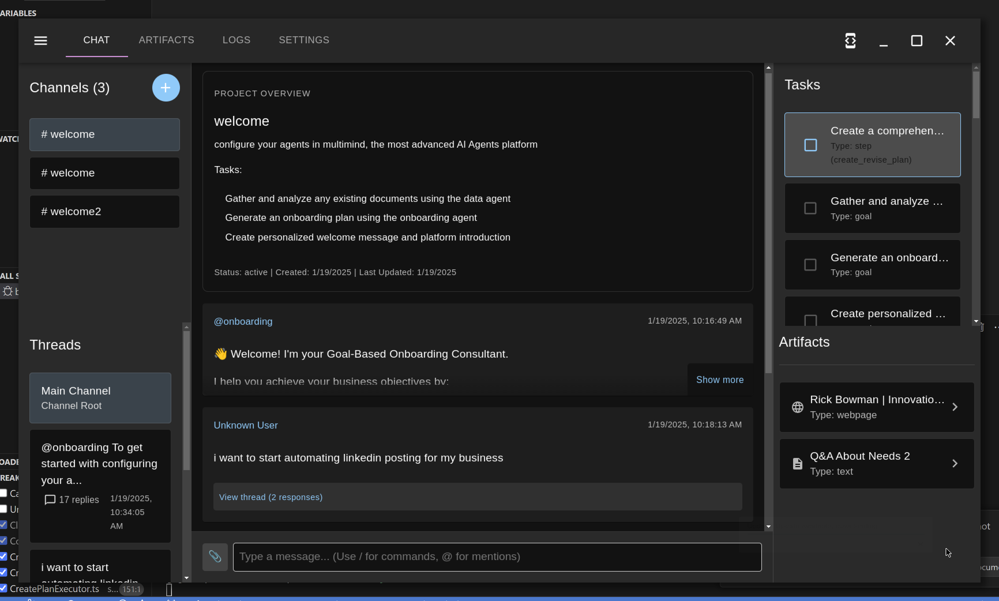

# Introduction to the AI Research Assistant

## Overview
The AI Research Assistant is a sophisticated platform that combines:
- Natural language processing
- Task automation
- Document generation
- Project management

## Key Features
- **Conversational Interface**: Interact through chat messages
- **Task Management**: Create and track projects and tasks
- **Document Generation**: Automatically create structured documents
- **Research Capabilities**: Web search and content summarization
- **Custom Workflows**: Create tailored automation processes

## Recommended Models
For best results, we recommend using one of these high-quality language models:
- **OpenAI GPT-4o** (via OpenAI API)
- **Anthropic Claude 3.5 Sonnet** (via Anthropic API)
- **DeepSeek V3** (via DeepSeek API)
- **Qwen 2.5 72B Instruct** (qwen/qwen-2.5-72b-instruct, available via OpenRouter)
- **NVIDIA Nemotron 70B Instruct** (nvidia/llama-3.1-nemotron-70b-instruct, available via OpenRouter)

## System Requirements
- **Operating System**: Windows 11, Mac OS X Sonoma, or a Linux distribution capable of running AppImage packaged applications
- Node.js 18+
- ChromaDB or Vectra vector database (optional)
- Supported LLM provider (LM Studio, OpenAI, Bedrock, etc.)
- Mattermost server (optional for chat interface)
- Settings configured through the Settings panel

## Getting Help
For support, you can open issues on the [GitHub public issues tracker](https://github.com/richardbowman/multimind-agent-platform/issues).

## Screenshot
Here is a screenshot of the welcome screen:

