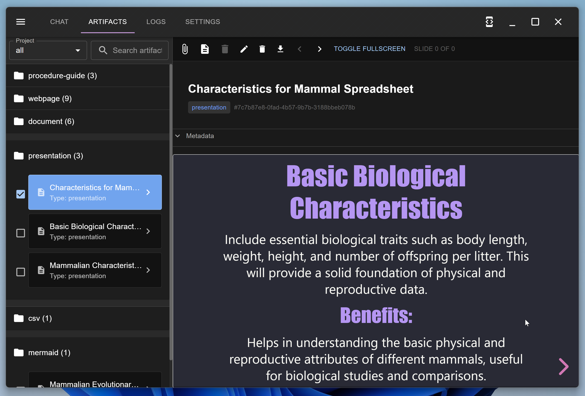
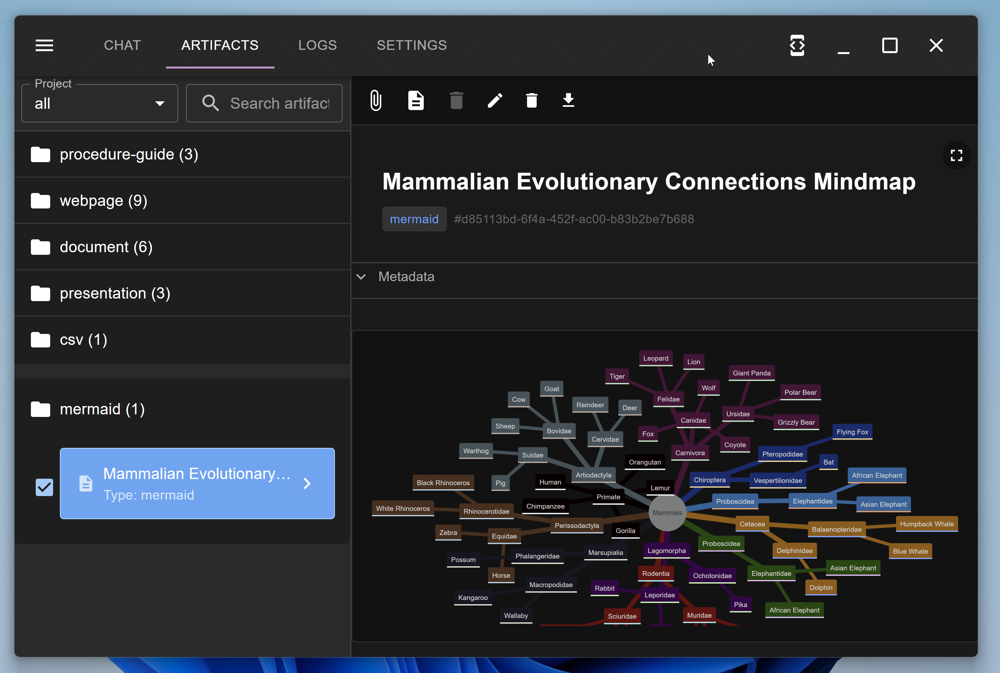
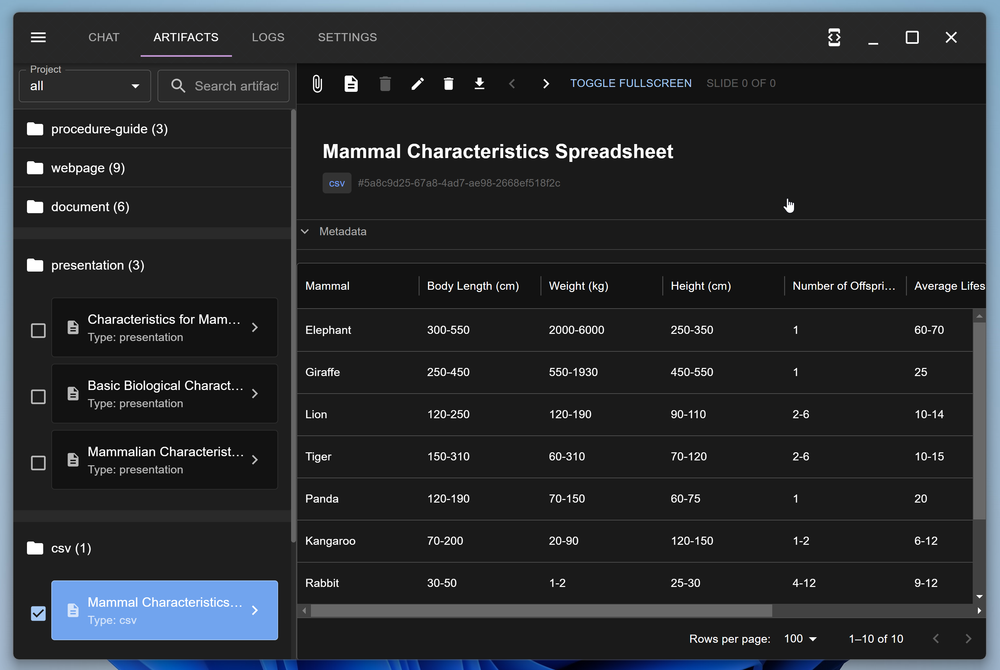

# Core Concepts

## Agents
The system uses specialized agents to handle different tasks:

- **Personal Assistant**: Can schedule tasks, create documents, and delegate to other agents in a channel
- **Research Manager**: Handles web searches and content analysis
- **Content Manager**: Manages document generation and editing
- **Project Manager**: Organizes tasks and workflows

## Tasks
Tasks represent individual work items:

- Types: Standard, Recurring, Steps, Goals
- Can be assigned to users or agents
- Track progress and completion status

## Artifacts
Generated content and outputs:

- Supports spreadsheets, Markdown, and diagrams
- Processed into vector database for search
- Version controlled and linked to tasks

{ width="300" }
{ width="300" }
{ width="300" }

## Conversations
Threaded chat system:

- Maintains context across messages
- Links to projects and tasks
- Supports attachments and structured data
