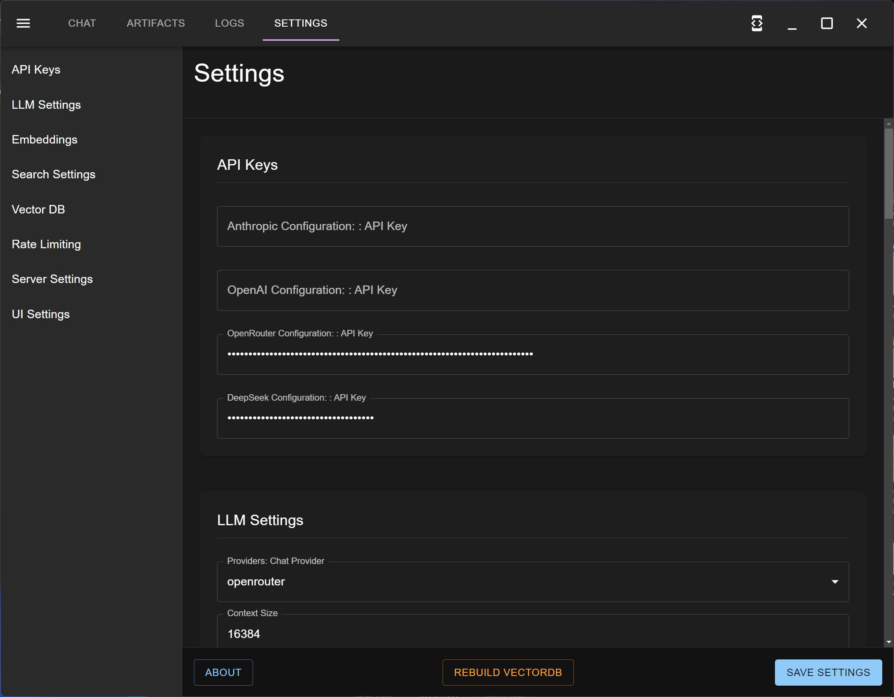
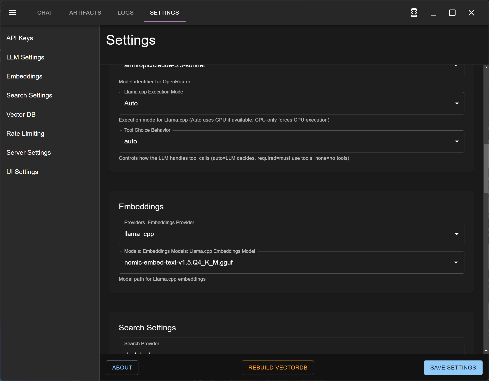

# Getting Started

## Installation

To install MultiMind, follow these steps:


1. **Download the latest release**: You can download the latest release from [GitHub releases](https://github.com/richardbowman/multimind-agent-platform/releases/).
2. **Install the package**:
   * **Windows**: Run the downloaded `.exe` installer.
   * **Mac OS X**: Open the downloaded `.dmg` file and drag MultiMind to your Applications folder.
   * **Linux**: Run the downloaded `.AppImage` file with the following command:

     ```bash
     ./path/to/multimind.AppImage
     ```
3. **Launch the application**:
   * **Windows**: Double-click the MultiMind application in your Applications folder.
   * **Mac OS X**: Open the MultiMind application from your Applications folder.
   * **Linux**: Ensure the `.AppImage` file has executable permissions and run it as shown above.

## Initial Configuration

Before you start using the welcome channel, you need to configure access to the models you will use for chat as well as embeddings. Some providers do not provide embedding capabilities.

### Chat Provider Configuration

We recommend using OpenAI, Claude, or DeepSeek as your main chat provider. A very easy way to be able to switch and try those models is to sign up for OpenRouter, which lets you use all of these models with one account and one set of credits.

Supported LLM providers are:

* LM Studio
* Llama CPP (Embedded)
* Open AI
* DeepSeek
* Anthropic (Claude)


1. Open the Settings panel from the main interface.
2. Configure required settings:
   * Select your LLM provider (e.g., LM Studio, OpenAI, Bedrock)
   * Set up API keys if using cloud providers
   * Configure vector database settings
   * Adjust search and research limits
3. Save settings—they will persist across sessions.

#### Chat Configuration Screenshot

 

### Embedding Configuration

For embeddings, we recommend running those locally by using the Llama CPP setting, and selecting one of the provided embedding models (we typically use nomic).


1. Open the Settings panel from the main interface.
2. Configure required settings:
   * Select the Llama CPP setting for embeddings
   * Choose one of the provided embedding models (e.g., nomic)
3. Save settings—they will persist across sessions.

#### Embeddings Configuration Screenshot

 

## Quickstart

To quickly test your configuration, create a channel called the **Chat Channel**. This channel will have access to a simple non-agentic agent that responds to your requests using the selected model. This is a good way to ensure that all your configuration is working correctly.


1. **Create a new channel**:
   * Click on the `+` icon to create a new channel.
   * Name the channel **Chat Channel**.
2. **Select the agent**:
   * In the channel settings, select the simple non-agentic agent.
3. **Start chatting**:
   * Type your messages in the chat box and see responses from the agent.

## Welcome Channel

When the application starts, it automatically creates a `#welcome` channel where you'll be guided through the onboarding process by the Onboarding Consultant agent.

The welcome channel helps you:

* Understand the platform's capabilities
* Define your goals and objectives
* Create your first project
* Set up initial tasks
* Configure your preferences

#### Welcome Channel Screenshot

 

## Onboarding Process

The Onboarding Consultant will guide you through these steps:


1. **Goal Definition**
   * Discuss your objectives
   * Identify key use cases
   * Determine success metrics
2. **Project Setup**
   * Create your first project
   * Define initial tasks
   * Set up supporting agents
3. **Documentation**
   * Generate onboarding documentation
   * Create operational guides
   * Establish best practices
4. **Training**
   * Educate agents on your goals
   * Configure agent behaviors
   * Set up monitoring and reporting

## First Steps in Welcome Channel


1. Respond to the Onboarding Consultant's questions about your goals.
2. Review and approve the generated project plan.
3. Monitor task progress through the chat interface.
4. Provide feedback to refine the onboarding process.

Example conversation flow:

```
[Onboarding Consultant] Welcome! Let's start by understanding your goals...
[You] I want to automate content creation for my blog
[Onboarding Consultant] Great! What topics do you want to cover?
[You] Technology trends and AI developments
[Onboarding Consultant] I'll create a content creation project for you...
```

## Next Steps

After completing onboarding:

* Explore other channels created for your projects.
* Use `/new` to start additional projects.
* Monitor progress through the task manager.
* Review generated artifacts and documents.


